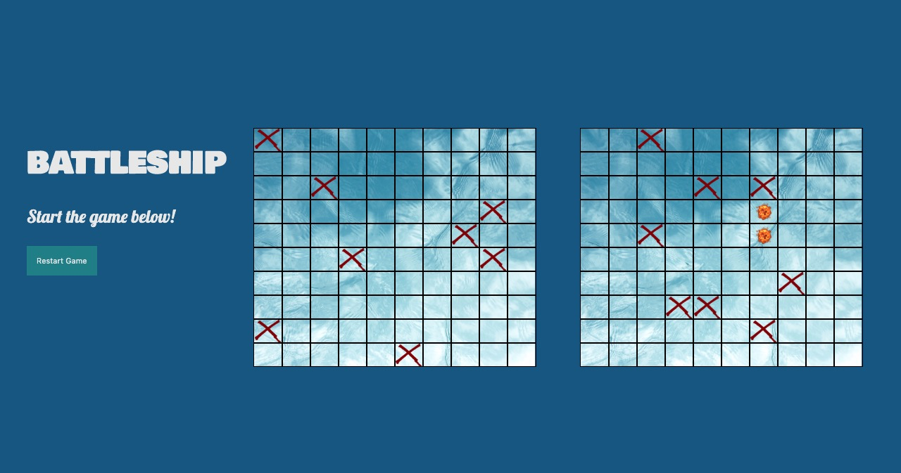

<h1 align="center">Battleship-JS</h1>

## Table of Contents
* [About](#About)
* [Live Demo](#demo)
* [Installation and Usage](#use)
* [Testing](#Testing)
* [Built With](#built)
* [Contributing](#Contributing)
* [Show Your Support](#show)
* [Authors](#Authors)

<p align="center">
  
</p>

## About

The aim of this project was to build a playable version of the classic game, Battleship, using mainly JavaScript technologies. You can view the project specifications [here](https://www.theodinproject.com/courses/javascript/lessons/battleship).

## Live Demo <span id="demo"></span>

Click [here](https://rawcdn.githack.com/KerronKing/Battleship-JS/56aac3cd696ecbe534c9d4430eeab7607ba826b0/dist/index.html) to see the live version.

## Installation and Usage <span id="use"></span>

* Open the terminal and clone the repo
```
https://github.com/KerronKing/Battleship-JS.git
```

* To launch the app, cd in the project directory and enter the following command in the terminal:
```
npm start
```

* Press 'Start Game' in to bring up the form.

* Enter you name and press "Submit".

* Play the game by clicking the enemy grid squares (the grid on the right).

* Restart the game by clicking "Restart Game" and pressing "Submit" on the form.

## Testing

* cd into the project directory after cloning.

* To run this app's test suite, open the terminal and enter the following command:
```
npm test
```

## Built With <span id="built"></span>

This page was built using the following technologies:
- JavaScript
- Webpack
- Jest
- HTML5
- CSS3

## Contributing

Contributions, issues and feature requests are welcome!

Feel free to check the [issues page](https://github.com/KerronKing/Battleship-JS/issues).

## Show your support <span id="show"></span>

Feel free to drop a :+1: to show your support. It'd be greatly appreciated it :pray:

## Authors

:bust_in_silhouette: Kerron King

* Github: [@KerronKing](https://github.com/KerronKing)
* Email: kerronk1989@gmail.com
* Linkedin: [Kerron King](linkedin.com/in/kerron-shawn-king)

:bust_in_silhouette: Eva Veskova Jackson

* Github: [Eva Veskova Jackson](https://github.com/evaveskova)
* Email: evaveskova@gmail.com
* Linkedin: [Eva Veskova Jackson](linkedin.com/in/evaveskova)

